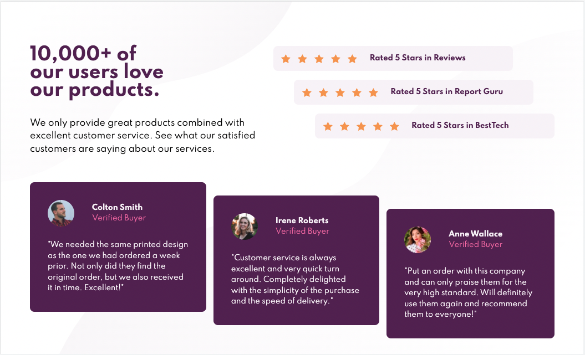

# Frontend Mentor - Social proof section solution

This is a solution to the [Social proof section challenge on Frontend Mentor](https://www.frontendmentor.io/challenges/social-proof-section-6e0qTv_bA). Frontend Mentor challenges help you improve your coding skills by building realistic projects.

## Table of contents

- [Overview](#overview)
  - [The challenge](#the-challenge)
  - [Screenshot](#screenshot)
  - [Links](#links)
- [My process](#my-process)
  - [Built with](#built-with)
  - [What I learned](#what-i-learned)
  - [Continued development](#continued-development)
  - [Useful resources](#useful-resources)
- [Author](#author)

**Note: Delete this note and update the table of contents based on what sections you keep.**

## Overview

### The challenge

Users should be able to:

- View the optimal layout for the section depending on their device's screen size

### Screenshot

### Links

- Solution URL: [Add solution URL here](https://jamgorilla.github.io/VS-live-server-skeleton/)

## My process

### Built with

- Semantic HTML5 markup
- CSS custom properties
- Flexbox
- CSS Grid
- SCSS
- Mobile-first workflow

**Note: These are just examples. Delete this note and replace the list above with your own choices**

### What I learned

I built the project twice. Got stuck the first time using vanilla CSS and sectioned out media queries for screen width. I was doing fine up until the responsive elements where I felt my lack of process in setting the various responsive sizes got me mixed up. I sought out some resources to help and found a video by Kevin Powell going through his solution using Live Sass compiler and VSC Live server. I used SCSS for the first time and learned how to section out the SCSS files into partials. I also learned grid and used it for the first time in the project in conjunction with Flexbox which I have used before.

Kevin used the media queries where they were needed inside each element tag. This is as opposed to creating seperate sections of media queries where the tags are repeated and overwritten at the different sizes. Both implementations can work but I think I will continue to use Kevin's method in future projects and see if it makes things clearer for me going forward.

### Continued development

I will definitely be using the same set up for the next projects I attempt unless they require a larger framework. So SCSS partials, SASS Live compiler, VSC Live Server and Github pages to host

### Useful resources

- [Example resource 1](https://www.youtube.com/watch?v=_a5j7KoflTs) - Sass tutorial
- [Example resource 2](https://www.youtube.com/watch?v=t6CBKf8K_Ac) - Grid tutorial
- [Example resource 3](https://www.youtube.com/watch?v=K27WULzr2P8&t=75s) - This is basically a full walkthough of this project so very helpful. Especially if you have already attempted it on your own first.

## Author

- Frontend Mentor - [@yourusername](https://www.frontendmentor.io/profile/yourusername)
